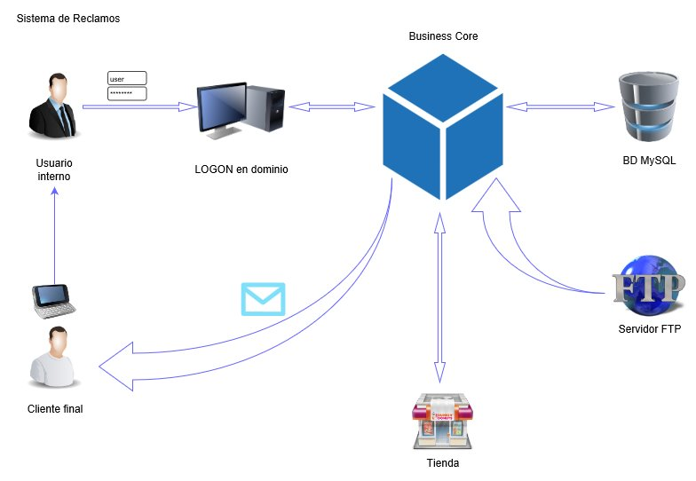

# IAPPReclamos

## Índice

+ [API REST](#API)
+ [Diagrama de arquitectura de Aplicación](#app)
+ [Spike tecnológico](#spike)

## Servicio de Gestión de Reclamos

El Servicio de gestión de Reclamos se encarga del procesamiento de Reclamos de Pedidos de Tienda Online, su tracking y la notifcación a los clientes que reclaman. 

<a name="API"/>
## API REST

Toda la información se encuentra en nuestro Portal de [API-DOC](https://google.com.ar).

<a name="app"/>
## Diagrama de arquitectura

 

## Servidor FTP

Diariamente el Servicio de Gestión de Reclamos buscará el lote de pediods del día anterior para poder realizarle un reclamo en caso que sea requerido.
El formato del nombre del archivo será el siguiente:

> PEDIDOS_{{$datetime}}.csv

> Ejemplo:
> PEDIDOS_20180924.csv

Y el contenido tendrá los siguientes datos:

|IdPedido  	|FechaEstimada	|MontoCompra|DNICliente	|NombreCliente	|MailCliente	|idProducto	|DescripcionProducto|
|:----------|:--------------|:----------|:----------|:--------------|:--------------|:----------|:------------------|
|000001		|2018-09-15		|180.00		|18345672	|Arturo Sampala	|arty@yahoo.com	|18976AT65	|Mouse para gamer	|

[Ver ejemplo adjunto](./docs/example.csv)

<a name="spike"/>
## SPIKE Tecnológico

+ Backend: JAVAEE 7
+ Frontend: HTML6 + CCS3 + Javascript
+ Framework: Springboot + JHipster
+ Base de datos: Mysql Server

